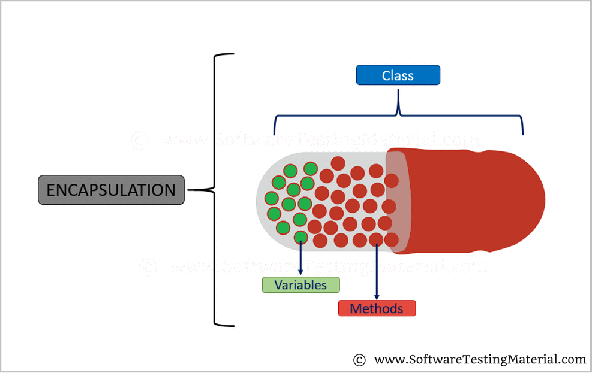

# HW3

## **Encapsulation**

--Technically in encapsulation, the variables or data of a class is hidden from any other class and can be accessed only through any member function of own class in which they are declared.

--As in encapsulation, the data in a class is hidden from other classes, so it is also known as data-hiding.

--Encapsulation can be achieved by: Declaring all the variables in the class as private and writing public methods in the class to set and get the values of variables.

## **Advantages of Encapsulation:**

---Data Hiding: The user will have no idea about the inner implementation of the class. It will not be visible to the user that how the class is storing values in the variables. He only knows that we are passing the values to a setter method and variables are getting initialized with that value.

---Increased Flexibility: We can make the variables of the class as read-only or write-only depending on our requirement. If we wish to make the variables as read-only then we have to omit the setter methods like setName(), setAge() etc. from the above program or if we wish to make the variables as write-only then we have to omit the get methods like getName(), getAge() etc. from the above program

---Reusability: Encapsulation also improves the re-usability and easy to change with new requirements.

---Testing code is easy: Encapsulated code is easy to test for unit testing.

## **Interfaces**

---Interfaces specify what a class must do and not how. It is the blueprint of the class.

---An Interface is about capabilities like a Player may be an interface and any class implementing Player must be able to (or must implement) move(). So it specifies a set of methods that the class has to implement.

---If a class implements an interface and does not provide method bodies for all functions specified in the interface, then class must be declared abstract.

---A Java library example is, Comparator Interface. If a class implements this interface, then it can be used to sort a collection.

## **Why do we use interface ?**

---It is used to achieve total abstraction.

---Since java does not support multiple inheritance in case of class, but by using interface it can achieve multiple inheritance .

---It is also used to achieve loose coupling.

---Interfaces are used to implement abstraction. So the question arises why use interfaces when we have abstract classes?

The reason is, abstract classes may contain non-final variables, whereas variables in interface are final, public and static. 

## **Important points about interface or summary of article:**

---We can’t create instance(interface can’t be instantiated) of interface but we can make reference of it that refers to the Object of its implementing class.

---A class can implement more than one interface.

---An interface can extends another interface or interfaces (more than one interface).

---A class that implements interface must implements all the methods in interface.

---All the methods are public and abstract. And all the fields are public, static, and final.

---It is used to achieve multiple inheritance.

---It is used to achieve loose coupling.
